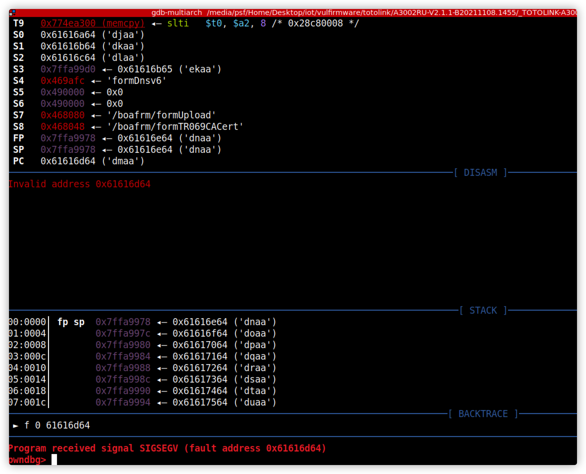
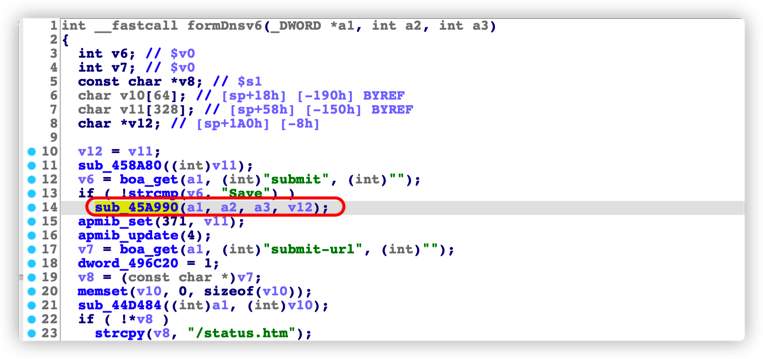
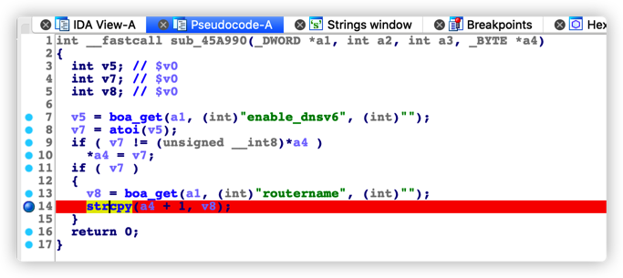

# TOTOLINK A3002RU boa formDnsv6 Stack Overflow

## Proof of Concept

## Affected Version

A3002RUV2 <= V2.1.1-B20211108.1455

## Vulnerability Description

The TOTOLINK A3002RU boa service interface does not strictly filter user input. Authenticated attackers can trigger a stack overflow vulnerability by constructing requests with a special format, potentially hijacking pointers or causing arbitrary code execution.

## Vulnerability Analysis

The `formDnsv6` request is as follows: When `submit` is `Save`, the execution enters the `sub_45A990` function. After receiving `routernamer`, the `sub_45A990` function directly uses `strcpy` to copy it to `a4`, causing a stack overflow vulnerability.

