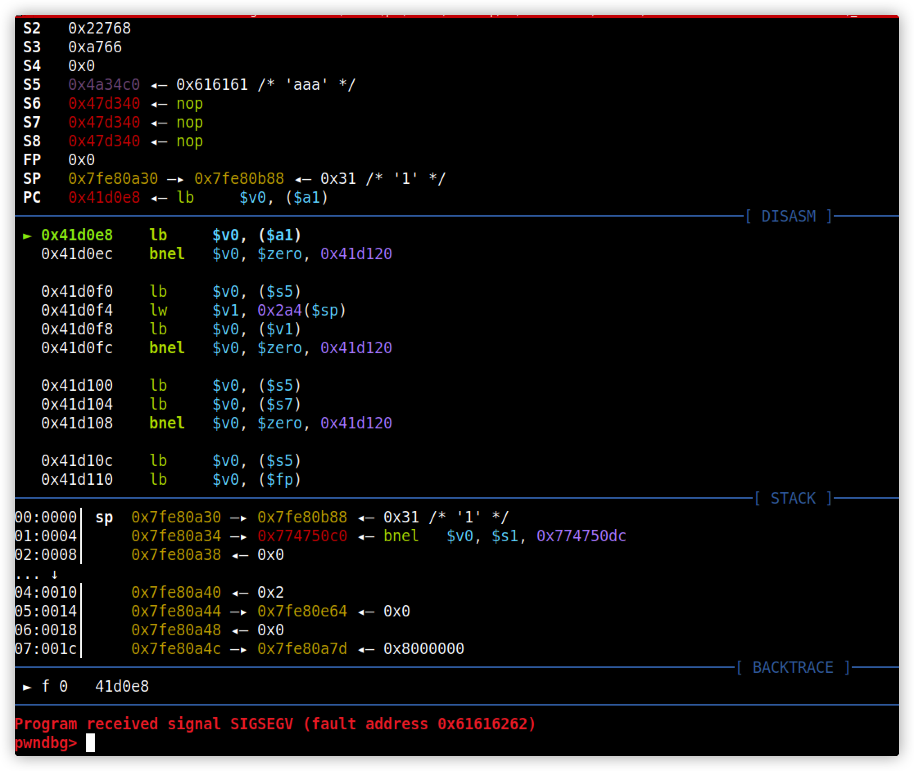
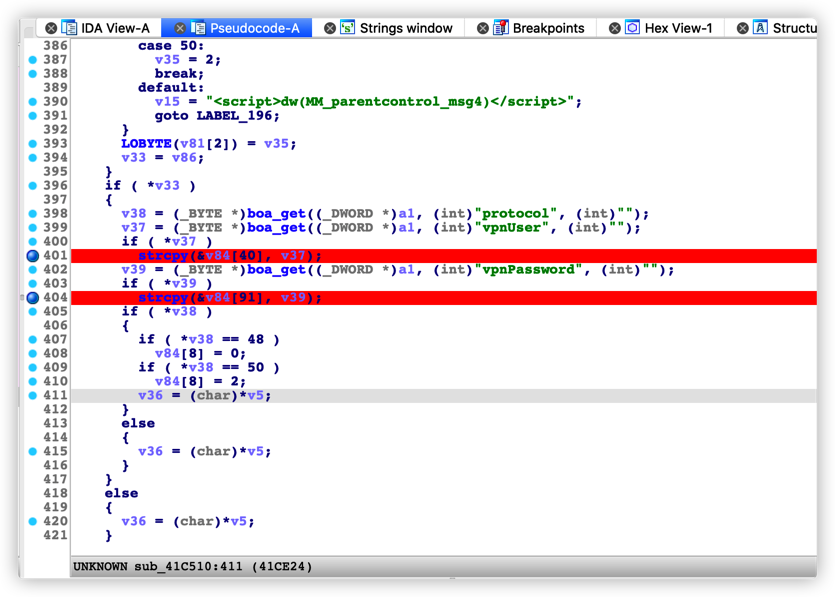

# TOTOLINK A3002RU boa formFilter Stack Overflow

## Proof of Concept

## Affected Version

A3002RUV2 <= V2.1.1-B20211108.1455

## Vulnerability Description

The TOTOLINK A3002RU boa service interface does not strictly filter user input. Authenticated attackers can trigger a stack overflow vulnerability by constructing requests with a special format, potentially hijacking pointers or causing arbitrary code execution.

## Vulnerability Analysis

The `formFilter` request is as follows: After receiving `vpnUser` or `vpnPassword`, it directly uses `strcpy`, causing a stack overflow vulnerability.

