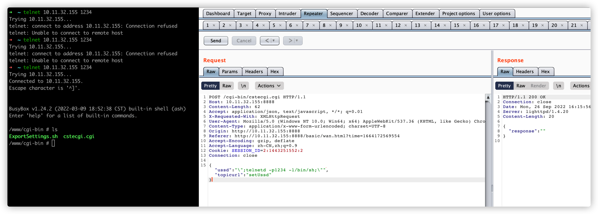
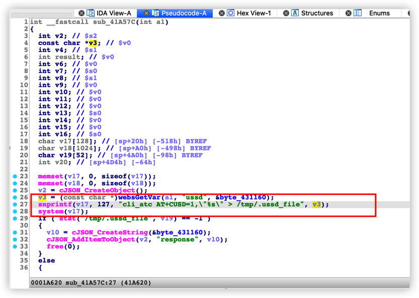

# TOTOLINK LR350 cstecgi.cgi setUssd Command Injection

## Proof of Concept

## Affected Version

LR350 <= LR350_V9.3.5u.6369_B20220309

## Vulnerability Description

The TOTOLINK LR350 (version <= LR350_V9.3.5u.6369_B20220309) cstecgi.cgi service interface does not strictly filter user input. Authenticated attackers can trigger a command injection vulnerability by constructing requests with a special format, causing arbitrary system command execution.

## Vulnerability Analysis

Firmware download address: https://www.totolink.net/home/menu/detail/menu_listtpl/download/id/231/ids/36.html

The `cstecgi.cgi setUssd` request is as follows: After receiving `uusd`, it uses `sprintf` to concatenate commands without checking or filtering shell metacharacters, and executes them with `system`, causing a command injection vulnerability.

