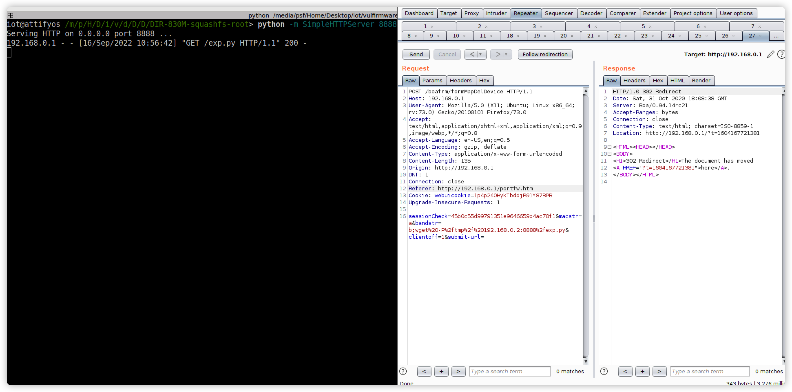
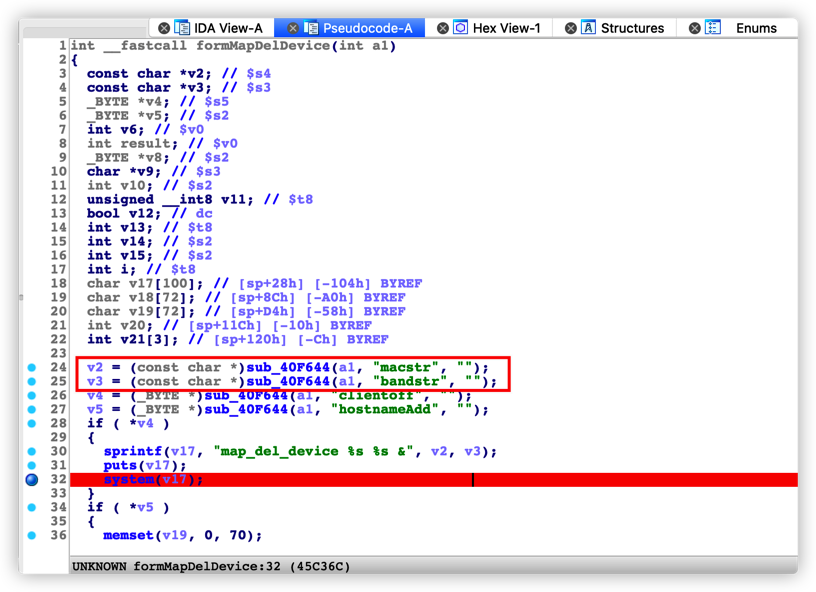

# TOTOLINK N200RE V5 cstecgi formMapDelDevice Command Injection

## Proof of Concept

## Affected Version

N200RE V5

## Vulnerability Description

The TOTOLINK N200RE V5 cstecgi service interface does not strictly filter user input. Authenticated attackers can trigger a command injection vulnerability by constructing requests with a special format, causing arbitrary system command execution.

## Vulnerability Analysis

The `formMapDelDevice` request is as follows: After receiving `macstr` and `bandstr`, it uses `sprintf` to concatenate commands without checking, and executes them with `system`, causing a command injection vulnerability.

